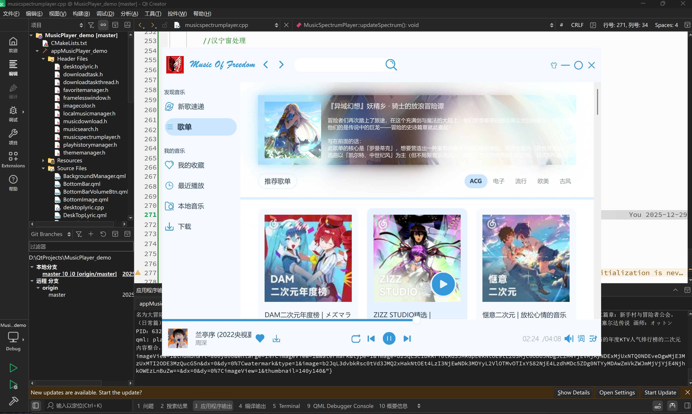

# 🎵 Music of Freedom (MusicPlayer_demo)

<p align="center">
  
</p>


**Music of Freedom** 是一款基于 **Qt 6 (QML)** 开发的现代化桌面音乐播放器。它不仅拥有极简且充满艺术感的 UI 设计（灵感来自“自由之翼”），更集成了在线搜索、高质下载、动态歌词及智能色彩提取等高级功能。

---

## ✨ 核心特性

### 🎨 极致视觉体验

* **智能背景 (Magic Background)**：基于 **K-means++ 算法** 实时从专辑封面提取主色调，配合平滑过渡动画，营造沉浸式听歌氛围。
* **无边框美学**：自定义现代标题栏，支持全局缩放、拖拽及流畅的页面切换动画。
* **动态歌词**：支持同步滚动歌词、翻译歌词，并配备独立的**桌面歌词窗口**。

### 🚀 强劲功能支持

* **全网音乐库**：集成网易云音乐 API，支持最新音乐、热门歌单浏览及智能搜索建议。
* **本地管理**：异步扫描本地文件夹，支持 SQLite 持久化存储与元数据自动提取。
* **下载引擎**：支持多线程下载与**断点续传**，轻松构建你的离线曲库。
* **性能优化**：深度使用 **Qt Concurrent** 与 **OpenMP** 并行计算优化，确保低 CPU 占用与极速响应。

---

## 🛠️ 技术栈

| 维度 | 技术选型 |
| --- | --- |
| **UI 框架** | Qt 6.2+ / QML (Quick Controls 2) |
| **逻辑核心** | C++ 17 |
| **媒体引擎** | Qt Multimedia |
| **数据存储** | SQLite (Qt SQL) |
| **并发/加速** | Qt Concurrent / OpenMP |
| **后端接口** | NeteaseCloudMusicApi |

---

## 🚀 快速开始

### 前置条件

1. **Qt 环境**：安装 Qt 6.2.0 或更高版本。
2. **API 服务**：本项目依赖 [NeteaseCloudMusicApi](https://github.com/Binaryify/NeteaseCloudMusicApi)。
```bash
# 启动 API 服务
git clone https://github.com/Binaryify/NeteaseCloudMusicApi.git
cd NeteaseCloudMusicApi && npm install && node app.js

```


### 构建步骤

```bash
# 1. 克隆仓库
git clone https://github.com/1024freedom/MusicPlayer_demo.git

# 2. 编译
mkdir build && cd build
cmake .. -DCMAKE_PREFIX_PATH=/path/to/your/Qt
cmake --build . --config Release

# 3. 运行
./appMusicPlayer_demo

```

---

## 📸 界面预览

<p align="center">
  
</p>

---

## 🛡️ 开源协议

本项目遵循 **MIT License**。欢迎任何形式的 Pull Request 或 Issue！

---

**喜欢这个项目吗？给个 Star 🌟 吧！这对我很有帮助！**

---

### 我可以为您进一步优化：

* **如果要发布到 GitHub**：我可以帮您编写 `.gitignore` 或 GitHub Actions 的自动化构建脚本。
* **如果要增加代码示例**：我可以帮您把核心的 `K-means` 颜色提取逻辑或 `QML` 动画代码整理成文档块。
* **如果需要界面截图建议**：我可以告诉您哪些界面的截图最能体现项目亮点。

您觉得这份新的 README 风格如何？
